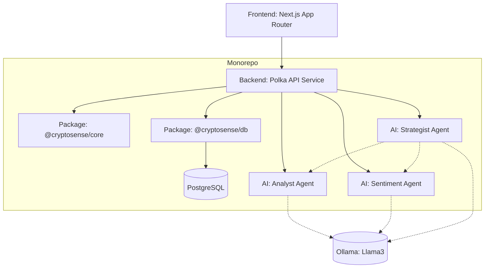
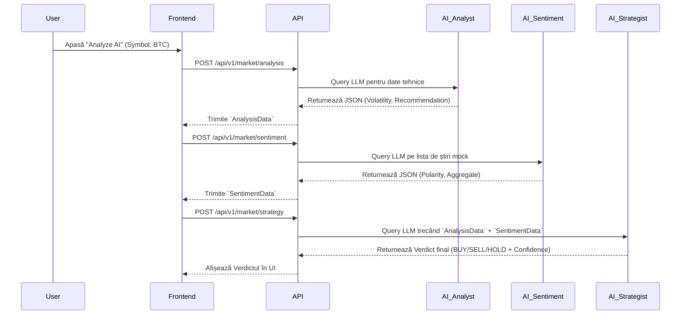

# CryptoSense: Multi-Agent Trading Insights

**Curs:** Metodologii de Dezvoltare Software (MDS) 2026

**Echipa:** Cristea Denis-Adrian, Liviu Marinică

**Link Demo**: ...

## 🏗️ Technical Architecture & Monorepo

The codebase is built as a scalable full-stack Node.js/TypeScript monorepo using **Yarn Workspaces** and **Turborepo**, heavily inspired by the `SimplyChords` architecture.

### Tech Stack

- **Monorepo Management:** Yarn 4 workspaces + Turborepo
- **Frontend Dashboard:** Next.js 15 (App Router), React 19, Tailwind CSS v4
- **Backend API:** Node.js with Polka
- **Database:** PostgreSQL (`packages/db`)
- **Shared Packages:** Types & Utilities (`packages/core`), TS/ESLint Configs (`packages/config`)
- **Testing:** Vitest
- **Linting:** ESLint v9 with `eslint-config-neon`

### Repository Structure

```text
├── apps/
│   └── dashboard/      # Next.js frontend application
├── packages/
│   ├── core/           # Shared business logic and utilities
│   └── db/             # PostgreSQL database client and schema
├── services/
│   └── api/            # Node.js backend microservice (Polka)
└── .github/            # CI/CD and AI Agent instructions
```

## ✅ MDS Grading Backlog & Criteria

- [ ] **User Stories & Backlog (minim 10):** _[Link to GitHub Projects / Issues]_
- [ ] **Diagrame (UML, architecture, workflows):** _[Link to diagrams]_
- [x] **Source control cu Git:** Branching, PRs, and commits actively maintained.
- [x] **Teste automate (inclusiv evals pt agenți):** Vitest configured across all packages and services.
- [ ] **Raportare bug și rezolvare cu PR:** _[Link to tracked bugs/PRs]_
- [x] **Pipeline CI/CD:** Defined in `.github/workflows/ci.yml` (Build, Lint, Test).
- [ ] **Raport utilizare tooluri AI:** _[Link to AI usage report document]_
- [x] **Integrare minim 2 Agenți AI:** Sistemul folosește Agentul Analist și cel de Sentiment (prin Ollama/fallback algoritmic).
- [ ] **Live Demo / Offline Screencast:** _[Link to YouTube / Demo]_

### Integrare Minim 2 Agenți AI 🤖

- **Analistul Tehnic**: Folosește prețurile din ultimele zile, calculează variații procentuale și emite un semnal + explicație pe zona tehnică.
- **Analistul de Sentiment**: Citește o listă de articole/stiri mockuite și atribuie automat `positive`, `negative`, sau `neutral` per headline, generând și un verdict general (Aggregate Score + Sentiment Text).
- **Strategistul (Decidentul Final)**: Așteaptă datele de la ambii sub-agenți de mai sus. Primește JSON-ul cu detaliile tehnice + contextul știrilor pe acel Symbol, apoi decide strategia finală (`BUY` / `HOLD` / `SELL`) alături de o estimare a încrederii.

---

## 🏛️ Arhitectura (Mermaid Diagrams)

### Diagrama Componentelor & Pachetelor 📦



### Flow-ul Decizional de Trading 📉



---

## 🚀 Getting Started locally

1. `yarn install`
2. `yarn dev` (start Dashboard & API)
3. `yarn test` (run Unit Tests & Evals)

---

## 📖 Descrierea Aplicației

**CryptoSense** este o platformă inteligentă de analiză a pieței crypto, creată pentru a oferi utilizatorilor decizii de tranzacționare informate, eliminând "zgomotul" informațional.

Sistemul se bazează pe o arhitectură de **micro-agenți autonomi** care colaborează pentru a analiza atât date cantitative (prețuri), cât și calitative (știri). Spre deosebire de aplicațiile web clasice, logica principală este condusă de inteligența artificială (modele de limbaj de dimensiuni mici care pot rula local).

### 🤖 Arhitectura Agenților

Sistemul nostru integrează 3 agenți specifici care reprezintă nucleul funcționalității:

1. **Agentul Analist (Analyst Agent):** Citește istoricul prețurilor (date OHLCV) din baza de date și identifică trenduri tehnice, suport, rezistență și anomalii (ex: scăderi bruște de volum).
2. **Agentul de Sentiment (News/Sentiment Agent):** Scanează automat titlurile de știri pentru ticker-ele urmărite și decide polaritatea pieței (Bullish/Bearish).
3. **Agentul Strateg (Investment Strategist):** Primește concluziile de la Analist și Sentiment, coroborează datele și formulează o recomandare acționabilă în limbaj natural (ex: _"Deși prețul Bitcoin scade, sentimentul știrilor este puternic pozitiv; recomandăm HOLD"_).

---

## 📋 Product Backlog & User Stories

### Epic 1: Infrastructură și Cont Utilizator

- [x] **US 1.0: Autentificare securizată**
  - **Descriere:** Ca utilizator, vreau să îmi creez un cont cu email și parolă pentru a-mi salva portofoliul urmărit.
  - **Criterii de acceptare:** Parolele sunt criptate (hash) în baza de date; sesiunea este menținută prin JWT.
- [x] **US 1.1: Sincronizare date de piață**
  - **Descriere:** Ca sistem, trebuie să preiau date de preț în timp real (via API public, ex: Binance/CoinGecko) pentru a alimenta Agentul Analist.
  - **Criterii de acceptare:** Datele sunt aduse și salvate în DB la un interval regulat (cron job).
- [ ] **US 1.2: Configurare portofoliu (Watchlist)** _(Backlog / Tehnic)_
  - **Descriere:** Ca utilizator, vreau să îmi pot alege monedele pe care le urmăresc, în loc ca sistemul să folosească o listă hardcodată.
  - **Criterii de acceptare:** DB extins cu un tabel `user_watchlists`, iar dashboard-ul permite adăugarea/ștergerea simbolurilor.

### Epic 2: Analiză Tehnică (Agentul Analist)

- [x] **US 2.0: Detectare automată a trendurilor**
  - **Descriere:** Ca trader, vreau ca Agentul Analist să identifice nivelurile de suport/rezistență, pentru a ști dacă activul este supra-vândut.
  - **Criterii de acceptare:** Agentul procesează array-ul de prețuri și returnează nivelurile cheie în UI. Backend-ul este conectat corect la un LLM local (Ollama).
- [x] **US 2.1: Alerte de volatilitate**
  - **Descriere:** Ca utilizator, vreau să primesc o alertă pe dashboard dacă Agentul Analist detectează o mișcare de preț mai mare de 5% în ultima oră.
  - **Criterii de acceptare:** UI-ul afișează o notificare de tip "Warning" generată de agent.

### Epic 3: Analiza Sentimentului (Agentul de Sentiment)

- [x] **US 3.0: Clasificarea știrilor recente**
  - **Descriere:** Ca utilizator, vreau ca Agentul de Sentiment să scaneze ultimele știri despre o monedă și să le clasifice ca pozitive, negative sau neutre.
  - **Criterii de acceptare:** Prompt-ul către agent forțează un output JSON strict cu polaritatea fiecărei știri. Agentul de sentiment a fost conectat.
- [x] **US 3.1: Scorul de Sentiment Agregat**
  - **Descriere:** Ca trader, vreau să văd un "Scor de Sentiment" (0-100) pentru a înțelege rapid panica sau euforia generală.
  - **Criterii de acceptare:** Afișarea grafică a scorului sub formă de progres/gauge pe pagina principală.
- [ ] **US 3.2: Integrare flux real de știri (News API)** _(Backlog / Tehnic)_
  - **Descriere:** Ca sistem, doresc să preiau știri financiare din surse reale (ex: CryptoPanic, NewsAPI) în detrimentul array-ului curent de mock/hardcodat.
  - **Criterii de acceptare:** Agentul de sentiment înghite feed-urile externe parzate în timp real în loc de funcția mock.

### Epic 4: Recomandări Strategice & Dashboard (Agentul Strateg)

- [ ] **US 4.0: Generarea recomandării finale**
  - **Descriere:** Ca utilizator, vreau ca Agentul Strateg să îmi ofere o concluzie clară (Buy/Sell/Hold) bazată pe datele celorlalți doi agenți.
  - **Criterii de acceptare:** Agentul primește contextul complet și returnează un paragraf explicativ scurt, fără a inventa date (fără halucinații pe preț).
- [~] **US 4.1: Dashboard centralizat** _(Parțial implementat)_
  - **Descriere:** Ca utilizator, vreau un panou principal unde să vizualizez prețul curent, scorul de sentiment și recomandarea AI simultan.
  - **Criterii de acceptare:** Interfață responsivă cu 3 secțiuni distincte, populate asincron. (Layout-ul HTML și agenții 1 & 2 există, lipsește UI-ul pentru Strategist).

### Epic 5: Evals & Calitatea Sistemului AI

- [x] **US 5.0: Evaluarea automată a halucinațiilor (Evals)**
  - **Descriere:** Ca dezvoltator, vreau un sistem automatizat care testează (evals) dacă Agentul / Sistemul recomandă corect pe baza unui set de date de test (mock data).
  - **Criterii de acceptare:** Există scripturi de test (`vitest`) scrise (`analyst.eval.test.ts`, `sentiment.eval.test.ts`) care validează formatul generat și fallback-urile non-LLM.
- [ ] **US 5.1: Feedback utilizator (Human-in-the-loop)**
  - **Descriere:** Ca utilizator, vreau să pot evalua recomandarea Agentului Strateg (Thumbs Up/Down) pentru a marca dacă a fost utilă.
  - **Criterii de acceptare:** Butoanele de feedback salvează răspunsul în baza de date pentru raportarea calității AI-ului.
